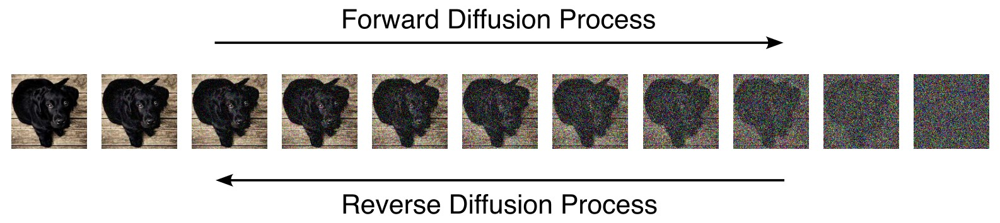

# Nano Diffusion - A Minimal Diffusion Implementation in PyTorch



## ⚠️ This repo is currently work-in-progress. Some documentation, functionalites and illustration may miss.

Getting to know a new model architecture is often overwhelming and advanced codebases are too complicated to understand or adapt for simply getting your hands dirty. This repository addresses this problem for understanding modern diffusion models. Here you find a with a minimal diffusion implementation that only uses PyTorch at its heart. Explore, modify, or simply train a vanilla diffusion model from scratch and get hands-on experience with the principles that drive modern image and video generation.

While transformers dominate ML discourse, diffusion models have quietly achieved state-of-the-art results across various domains, including language tasks, and can address some limitations of auto-regressive models. This repo gives you a quick start in your diffusion journey and allows you to begin your first diffusion training run in minutes.

The repo contains a Diffusion Transformer (DiT) model, trainer, noise schedulers, and sampler, all written as a minimalist PyTorch implementation so that you can check out the what the code does and tweak it.

TODO: Add section about class-conditioned generation and choice of dataset.

## Getting Started
This section helps you to set up your training environment and get your first training run started. If you want to learn more about what diffusion exactly is and how it works, check out the [Notebooks](#notebooks) section.
### Using a Docker Container
The project provides a custom Docker container so you don't have to mess with the PyTorch version and it's CUDA dependencies. If you want to run the code directly on your machine instead, you can skip this section. The Docker setup provides some quality-of-life features, such as an MLflow dashboard, a Jupyter server on port, SSH, persistent volumes so that training logs and model checkpoints keep retained and datasets don't have to be redownloaded at every restart of the container. Furthermore, the setup script pulls the repo on container boot-up so that it always works with the latest code without rebuilding the image.

#### Why using Docker?
If you already know Docker, go directly to [Building the Docker Image](#building-the-docker-image), otherwise here's a quick explanation why Docker is actually a great tool when developing stuff. Using Docker provides a lot of advantages beyond just the CUDA mess (which is definitely already enough reason on it own!). The main idea of Docker is to isolate an environment you want to run from your actual host environment. This means that Docker allows you to tweak your development environment without changing anything your own computer's setup. If you need to a specific software for your project, e.g. a server for model inference, then you can install and use it in your Docker container without bloating your host OS or interferring with version conflicts. It also makes your setup portable. Maybe you do some early tests with samller models on your home computer, but if you start working with bigger models, you will probably need to switch to a cloud provider that offers more computing power. Docker ensures that your setup works exactly the same when you use it on another infrastructure. Even if it seems daunting to use yet another tool, I think it's well worth to get comfortable with Docker. 

#### Building the Docker Image
First, create a `.env` file in the `docker` directory (that's important, otherwise Docker Compose won't pick it up), with variables you see in the example below and enter the values according to your project.

```bash
# Change the name of the repo in case you forked it
REPO_NAME=nano256/nano-diffusion
# This make sure that you also can pull your repo even if it's private
GITHUB_TOKEN=your-gh-token
# Protects the exposed Jupyter Notebook service with a password
JUPYTER_PASSWORD=your-password
# SSH password for "user"
SSH_USER_PASSWORD=your_secure_password
# SSH password for root. If not set, allows passwordless sudo
SSH_ROOT_PASSWORD=your_root_password
```
Build the image locally by executing following command from the proect root.

```bash
docker compose -f docker/docker-compose.yml build
```
#### Starting the Docker Container
Start a Docker container in the detached mode from the project root:

```bash
# Starts a container in detached mode
docker compose -f docker/docker-compose.yml up -d
```
It's important to use Docker Compose for launching the container since ´docker-compose.yml´ manages the persistent volumes, secrets, and GPU configs. 

#### Interacting with the Docker Container
If you have shell access to the computer that runs the container, you can access the container's shell by exectuing the `bash` command via Docker Compose from the `docker` directory.

```bash
docker compose exec workspace bash
```

Since the Docker container has a SSH service running that is bound to your host's port `2222`, you can also connect via SSH.

```bash
ssh -p 2222 root@localhost
```

Your container also runs a Jupyter server on http://localhost:8888 where you can play around with the instructional notebooks, do data exploration or model inference. There's also a MLflow dashboard on http://localhost:5000 where you can check on the logs of your experiments.

### Setting Up the Python Environment
Clone the repository and set up a virtual Python environment (I recommend pyenv). Make sure that you use Python 3.12 or higher. Navigate to the root folder of the cloned repository and install the dependencies:
```bash
git clone https://github.com/nano256/nano-diffusion.git

cd nano-diffusion/

# Creates a new venv for your project dependencies
pyenv virtualenv 3.12 nano-diffusion

# Sets it as default venv when in this directory
pyenv local nano-diffusion

pip install -r requirements.txt
```

### Downloading and Preprocessing the Data
Now download and transform the CIFAR-10 data. 
```bash
python preprocessing/encode_cifar.py
```

### Training a Model
TODO: Training run explanation
```bash
python train/train.py
```

### Monitoring a Run
Open a separate terminal and start the MLflow server:
```bash
mlflow server --host 127.0.0.1 --port 5000
```
Now you should be able to access the MLflow UI from your browser at http://127.0.0.1:5000.

TODO: Add a short explanation of the most important nomenclature of MLflow, along with some screenshots how your runs will look like.

## Model Inference
The repository provides some scripts so you can generate images after you trained a model. Alternatively, download a pretrained checkpoint here (TODO: Upload a checkpoint somewhere to download) and run it instead.
### Use the Notebook
The model inference notebook provides you with the possibility to load and use a model checkpoint to generate samples of the different classes in a straightforward way. Furthermore, there is also a part that let's you generate noise trajectories of your generations, so that you can see how the model progresses from noise to a coherent image over intermediate steps.

TODO: Add a figure of a denoising trajectory and the diffent class generations.

### Via CLI
If you want to generate a larger batch of images, you can use the `inference/generate_samples.py` script. You can either hand the class labels as an argument via CLI or provide them as a YAML file.

## Changing Configs
All script arguments are handled over config files. You can find a variety of different model and training configurations in the `config` folder.

`config.yaml`: Default config that will be chosen if not stated differently. Contains everything you need for a vanilla training run.
`config_debug.yaml`: Used for debugging and sanity checks of the codebase.Only uses a subset of the actual dataset and a much smaller model.
`config_full.yaml`: Contains all config parameters available, along with comments explaining their purpose. A great entry point if you want to tinker with a custom config yourself.

### Running Scripts with a Different Config
You can override the default config by using `--config-name`.

```bash
python train/train.py --config-name=config_debug
```

You can also just override a single parameter. In case that you want to use the default config but change the batch size, you can just define it via CLI:

```bash
python train/train.py batch_size=128
```

You can find more information about Hydra CLI functionalities here: [Basic Override Syntax | Hydra](https://hydra.cc/docs/advanced/override_grammar/basic/)

## Notebooks
The repo comes with some notebooks that make your journey into diffusion easier. 
| Notebook | Content |
|---|---|
|`notebooks/diffusion.ipynb`| A general introduction into the mathematical framework of diffusion. Rather than explaining model architectures and training techniques, this notebook focuses on giving an illustrated and intuitive picture of the framework, its modeling, and different proceddings in the field. A great start to your diffusion journey, where you only need basic understanding of mathematics and ML to dive to understand how diffusion actually works. |
|`notebooks/noise_scheduling.ipynb`| A technical explanation of noising scheduling, the pitfalls, and how the choice of different approaches impact the model performance. How we destroy information in our target data to create the data points from which our models learn to generate the original data is paramount to the training efficiency and final output quality of our models. This notebook builds with plots and illustrations your intuition of the noising process. |
|`notebooks/model_inference.ipynb`| A notebook that contains plots to play around with models you trained yourself. If you want to check out how a model check point behaves, use this notebook to load and infere it.|

## What's Included
All the essential parts are implemented in pure PyTorch for maximal tweakability. 
| Module | Path | Description |
| --- | --- | --- |
| `NanoDiffusionModel` | `diffusion/model.py` | Diffusion transformer model widely based on the Pixart-Alpha architecture[^1]. Unless otherwise stated, all implementations mentioned are taken from this paper.|
| `DiTBlock` |`diffusion/modules.py`| A transformer block version adjusted to for diffusion. The DiT architecture deviates from the original architecture by introducing the adaLN-Single scale & shift blocks and introducing cross-attention for conditioning. |
| `PatchEmbedding` |`diffusion/modules.py`| Breaks down a two-dimensional image latent in a sequence of tokens. |
| `AdaLNSingle` |`diffusion/modules.py`| Shifts and scales parameters depending on the current timestep and DiT block. This is a parameter-efficient implementation of adaLN[^2] |
| `Reshaper` |`diffusion/modules.py`| Converts a sequence of tokens back to a 2D-dimensional image latent. |
|`LinearNoiseScheduler`, `CosineNoiseScheduler`, `SigmoidNoiseScheduler`|`diffusion/noise_schedulers.py`| Three noise schedulers that decide the step size at different stages in the denoising process of the diffusion model. The implementations for all three noise schedulers were taken from this ablation study[^3]. |
| `DDIMSampler` |`diffusion/samplers.py`| Breaks down a two-dimensional image latent in a sequence of tokens. |
| `NanoDiffusionTrainer` |`diffusion/trainer.py`| Manages everything from training loop, checkpointing, and logging. Uses MLflow as default logger. |

### What's not Included
#### VAE
Training a VAE from scratch is a whole project on its own and since this repository should be a first hands-on exerience with diffusion models, we work with a pretrained VAE.

#### Text Conditioning
`NanoDiffusionModel` is class-conditioned, which means that we use a simple embedding layer for generating the conditioning token. This is done to make the model more resource-efficient. Just to give you some perspective, our conditioning layer approxiamtely makes up 0.1% of our total model parameters (7'680 of 89M parameters in the default model), while in text-conditioned models, like Stable Diffusion 3, the text encoders are often as big or bigger as the denoising backbone itself (Text encoding: 7B total (CLIP-L 428M + OpenCLIP bigG 1.8B + T5-XXL 4.7B) vs. Denoising backbone (2B for Medium and 8B for Large)[^4]). While you usually don't need the text encoders for training (the text prompts are ususally embedded once during data preprocessing), it puts a strain on your hardware during inference.

#### No (Advanced) Training Acceleration Techniques
This codebase is deliberately kept simple so that you don't have to fight through tons of additional concepts aside of basic diffusion itself and that the code stays managable and extendable. But if you are interested to learn more about improving training speed, check out the [What to Do Next?](#what-to-do-next) section.

## What to Do Next?
So you you studied the code and trained your first diffusion model from scratch - what's next? The best way to learn something is by following your curiosity and getting your hands dirty. Play around with the hyperparameters, check out what others are doing, read up on some of the developments in ML research, and then fork the repository and try to implement it. Below you find some ideas to get you started:

- Do an ablation study: (see [Changing Configs](#changing-configs))
- Train on a different dataset
- Modify the architecture
- Implement data augmentation
- Implement another sampler
- Try to improve training speed

## References
[^1]: [PixArt-Alpha: Fast Training of Diffusion Transformer for Photorealistic Text-to-Image Synthesis](https://arxiv.org/abs/2310.00426)
[^2]: [FiLM: Visual Reasoning with a General Conditioning Layer](https://arxiv.org/abs/1709.07871)
[^3]: [On the Importance of Noise Scheduling for Diffusion Models](https://arxiv.org/abs/2301.10972)
[^4]: [Scaling Rectified Flow Transformers for High-Resolution Image Synthesis](https://arxiv.org/abs/2403.03206)


